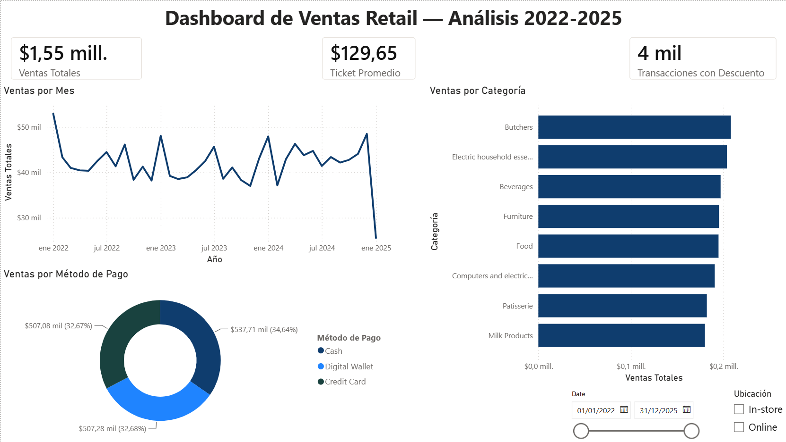
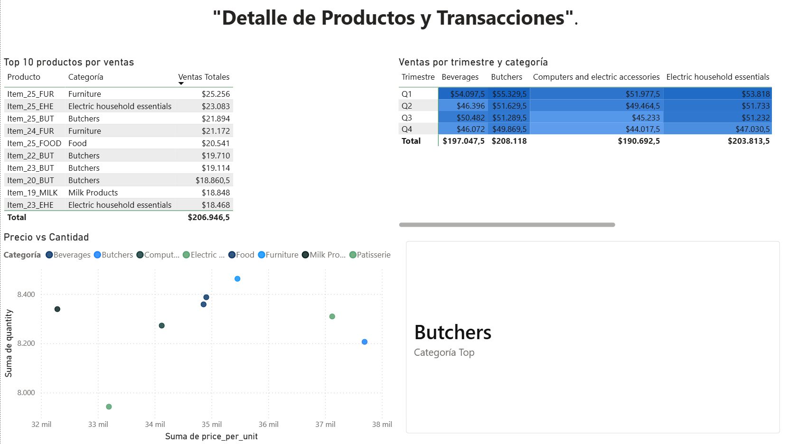

# 📊 Retail Sales Dashboard — SQL + Power BI

Dashboard interactivo de ventas retail construido sobre una base de datos con 
problemas reales de calidad de datos, combinando auditoría y limpieza en SQL 
(PostgreSQL) con modelado y visualización en Power BI.

## Business Task
Analizar transacciones de venta retail (2022-2025) para identificar patrones de 
ventas por categoría, método de pago y periodo, entregando un dashboard interactivo 
que permita explorar el desempeño comercial sin depender de reportes estáticos.

## Dataset
"Retail Store Sales: Dirty for Data Cleaning" (Kaggle) — 12,575 transacciones 
sintéticas con nulos e inconsistencias reales, ideal para practicar limpieza de datos.

## Proceso

### 1. Auditoría de calidad de datos (SQL)
- 0 duplicados, 0 inconsistencias aritméticas.
- Nulos concentrados en `item` (9.6%), campos numéricos (~4.8%), y 
  `discount_applied` (33.4%).
- Ver [`sql/02_data_quality_audit.sql`](./sql/02_data_quality_audit.sql).

### 2. Limpieza vía vista SQL
- Recuperación de `price_per_unit` faltante mediante fórmula 
  (`total_spent / quantity`), aprovechando que la relación aritmética es 100% 
  consistente en los datos disponibles.
- Exclusión de filas no recuperables, imputación documentada de nulos categóricos.
- Resultado: 11,971 filas limpias (95.2% de los datos originales).
- Ver [`sql/03_cleaning_views.sql`](./sql/03_cleaning_views.sql).

### 3. Modelado y visualización (Power BI)
- Conexión directa PostgreSQL → Power BI vía la vista `clean_sales`.
- Tabla de calendario y medidas DAX (ventas totales, ticket promedio, 
  comparación mes anterior, top categoría dinámica).
- Dashboard de 2 páginas: resumen ejecutivo y detalle de productos.

## Capturas

## Hallazgos clave
- [Completa con 2-3 insights reales que veas en tu dashboard, ej. categoría con 
  más ventas, método de pago dominante, tendencia temporal]

## Herramientas
PostgreSQL, SQL, Power BI (Power Query, DAX), Python (carga de datos vía SQLAlchemy).

## Archivo del dashboard
El archivo `.pbix` está en [`powerbi/retail_dashboard.pbix`](./powerbi/retail_dashboard.pbix) 
(requiere Power BI Desktop para abrirlo).
